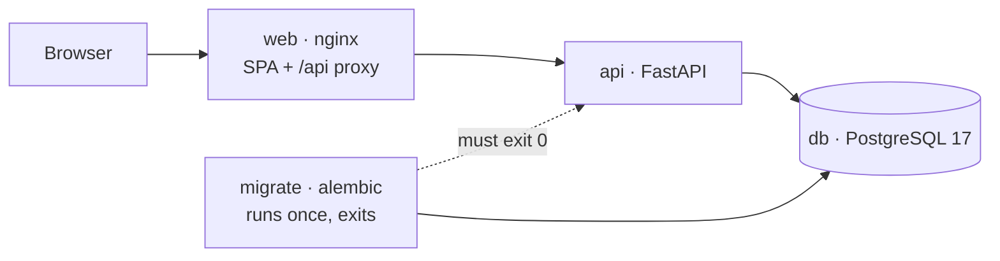

# SmartHire

Intelligent Workforce Orchestration & Recruitment Platform.
**Module 1 — Foundation + Core Services.**

Job and candidate management, the application pipeline, and the hiring rules the brief
names: duplicate prevention, eligibility checks and application limits.

## Quick start

```bash
cp .env.example .env
cd frontend && npm install && npm run build && cd ..
docker compose up --build
```

| Surface | URL |
|---|---|
| Recruiter console | http://localhost:3000 |
| API | http://localhost:8000 |
| Interactive API docs | http://localhost:8000/docs |
| PostgreSQL | localhost:5432 |

Load demo data — including deliberate rule violations — with:

```bash
python scripts/seed.py
```

> The frontend is built on the host rather than inside its image because this network's
> TLS inspection breaks `npm install` in containers. See
> [frontend/README.md](frontend/README.md#known-environment-issues).

## Repository

```
backend/     FastAPI + PostgreSQL. The Module 1 deliverable.
frontend/    React + TypeScript console, built with Vite.
docs/        PRD and architecture documentation.
scripts/     seed.py — demo data via the API.
```

## Services

`docker compose up` starts four, in a deliberate order: `db` must report healthy, then
`migrate` runs `alembic upgrade head` and must exit 0, and only then does `api` start.
`web` serves the built SPA and proxies `/api` to the API — same origin, so the project
needs no CORS configuration anywhere.



## Documentation

| Document | Contents |
|---|---|
| [docs/PRD.md](docs/PRD.md) | Use cases, functional and non-functional requirements, traceability |
| [docs/ARCHITECTURE.md](docs/ARCHITECTURE.md) | Layering, data model, ten design decisions with tradeoffs |
| [backend/README.md](backend/README.md) | API reference, error codes, business rules, tests |
| [frontend/README.md](frontend/README.md) | Vite-over-Next.js rationale, generated API types |

## Tests

```bash
docker compose up -d db
cd backend && pytest        # 35 tests against real PostgreSQL
ruff check .
cd ../frontend && npm run typecheck
```

## Module roadmap

| Module | Scope | Status |
|---|---|---|
| 1 | Foundation + core services | **Complete** |
| 2 | Business logic + Temporal workflows | Next |
| 3 | Event-driven system + observability | Later |
| 4 | Semantic layer — embeddings, vector search | Later |
| 5 | AI assistant — LangGraph, recommendations | Later |

Out of scope for Module 1: Temporal, Kafka, Celery, OpenTelemetry and the GenAI layer.
The seams they attach to — the job publishing transition, the HTTP-free service layer,
the request-id context — are already in place.

**Known gap:** there is no authentication. Every endpoint is open. It is documented in
the PRD and the architecture notes, and it is the first thing to fix.
