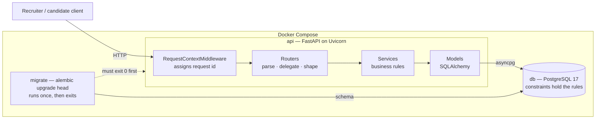
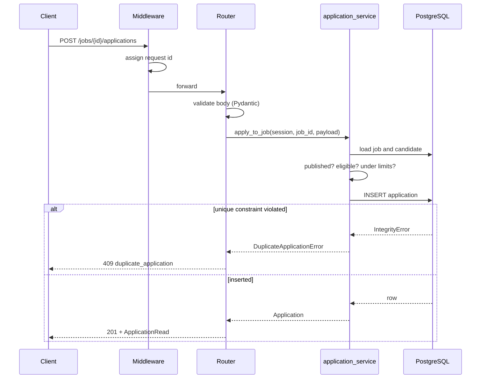
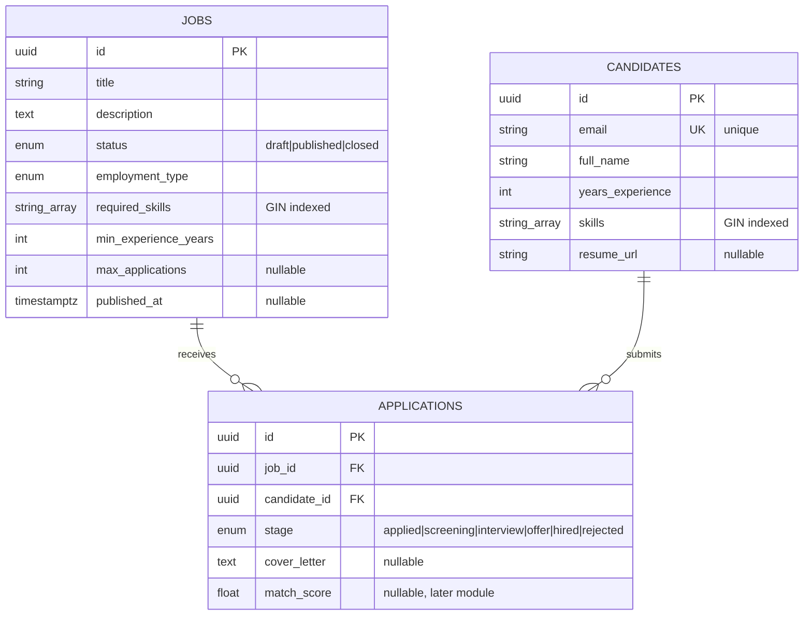

# SmartHire — Architecture and Design Decisions

**Module 1: Foundation + Core Services** · 21 September 2026

This document covers the service breakdown, data and request flow, and — most of all —
the decisions taken, the alternatives rejected, and why.

---

## 1. System shape

Three services. `db` starts first and must report healthy; `migrate` then brings the
schema up to date and exits; only then does `api` start. The API can therefore never
serve traffic against an outdated schema.

## 2. Layers

| Layer | Knows about | Must not know about |
|---|---|---|
| `api/routers` | HTTP, status codes, query parameters | Business rules, SQL |
| `services` | Business rules, the session, domain errors | HTTP, FastAPI, status codes |
| `models` | Tables, columns, constraints | HTTP, Pydantic |
| `schemas` | The API contract | Tables |
| `core` | Config, engine, errors, logging | Domain rules |

The rule that matters: **services raise `DomainError`, never `HTTPException`.** Each
domain error carries a status code as an attribute, and one handler in `core/errors.py`
turns it into a response. The payoff is direct — when Module 2 calls `apply_to_job` from
a Temporal activity, there is no HTTP layer to strip out.

### Request flow for an application

## 3. Data model

`applications` carries a unique constraint on `(job_id, candidate_id)`.

## 4. Design decisions

### 4.1 Applications are a table, not a foreign key

**Decision.** The candidate–job relationship is its own entity.

**Alternative rejected.** A `job_id` column on candidates, or an array of applied job ids.

**Why.** The relationship carries its own data: which stage it has reached, when it was
submitted, the cover letter, and the match score a later module computes. A foreign key
has nowhere to put any of that. This is the textbook case for a join table with
attributes, and it is also what makes "advance an application" a meaningful operation.

### 4.2 Duplicate prevention lives in the database

**Decision.** A unique constraint on `(job_id, candidate_id)`, plus a service-level
pre-check that exists only for the error message.

**Alternative rejected.** A `SELECT` to check for an existing application, then `INSERT`.

**Why.** The check-then-write pattern is not correct under concurrency. Two requests can
both run the `SELECT`, both see nothing, and both `INSERT` — and the rule the brief asked
for is silently broken under exactly the load the platform is being built to handle. The
constraint is the only thing the database will not let two transactions past.

The pre-check stays because it produces a clear 409 on the common path without burning a
failed transaction. It is an optimisation, not the guarantee — and `test_the_database_itself_refuses_a_duplicate`
bypasses the service entirely to prove which one is load-bearing.

**Tradeoff.** The `IntegrityError` handler needs a `rollback`, and a race produces a
slightly more expensive request. Worth it for a rule that actually holds.

### 4.3 Lifecycle transitions are endpoints, not field edits

**Decision.** `POST /jobs/{id}/publish` rather than `PATCH {"status": "published"}`.

**Why.** Publishing has rules (a closed job cannot be published) and side effects (it sets
`published_at`). A field edit implies neither. It also gives Module 2 an obvious seam:
the Temporal publishing workflow replaces the body of `publish_job` and nothing else moves.

**Tradeoff.** Less RESTful-purist. Named actions for state machines are clearer to both
callers and reviewers.

### 4.4 Separate schemas from models

**Decision.** `schemas/` (Pydantic) and `models/` (SQLAlchemy) are distinct, with three
schemas per resource — `Create`, `Update`, `Read`.

**Alternative rejected.** One shared model, as SQLModel encourages.

**Why.** They answer different questions. `JobCreate` has no `status` field, which is
precisely how a client is prevented from creating an already-published job. `CandidateUpdate`
has no `email`, which is how identity is protected from a casual PATCH. Those omissions
*are* the security model; a shared model cannot express them.

**Tradeoff.** More files and some duplicated field declarations.

### 4.5 Async all the way down

**Decision.** FastAPI, SQLAlchemy async, asyncpg.

**Why.** One blocking call inside `async def` stalls the event loop for every concurrent
request. Mixing a blocking driver into an async stack is the most common way an async
Python service ends up slower than a synchronous one.

**Tradeoff.** Async SQLAlchemy is harder — sessions cannot be shared across tasks, lazy
loading of relationships raises instead of silently querying, and the test suite needs a
single event loop for its connection pool.

### 4.6 Tests run on real PostgreSQL

**Decision.** A `smarthire_test` database, created on demand, dropped afterwards.

**Alternative rejected.** SQLite in memory.

**Why.** Everything this suite exists to prove is Postgres-specific: the unique constraint
under concurrency, array containment with GIN indexes, native enum types. SQLite either
behaves differently or lacks them. A suite that passes on a database you do not deploy
proves very little.

**Tradeoff.** Tests need Docker running. The fixture skips with a clear instruction
rather than failing cryptically.

### 4.7 One error envelope

**Decision.** Every failure, including FastAPI's own validation errors, returns
`{"error": {"code", "message", "request_id"}}`.

**Why.** A client can branch on a stable `code` rather than pattern-matching prose, and
every response carries the id needed to find the matching server logs. Reshaping
`RequestValidationError` matters most — otherwise the single most common error in the API
is the one with a different shape.

### 4.8 UUID primary keys

**Decision.** UUIDv4, generated in Python.

**Why.** Sequential ids leak business information — `/jobs/1` and `/jobs/2` tell a
competitor how many jobs exist, and let anyone enumerate the table. Generating in Python
means an object has its id before it reaches the database, which simplifies the code that
creates related rows.

**Tradeoff.** 16 bytes rather than 4, and random UUIDs fragment index locality. Irrelevant
at this scale; UUIDv7 is the answer if it ever matters.

### 4.9 Migrations as a separate Compose service

**Decision.** A one-shot `migrate` service that the API waits on via
`service_completed_successfully`.

**Alternative rejected.** Running migrations in the app's startup hook.

**Why.** With N API replicas, a startup-hook migration runs N times concurrently. Making
it a distinct step that must exit 0 means a failed migration stops the deploy rather than
leaving a half-migrated application serving traffic.

### 4.10 Terminal stages do not count toward the limit

**Decision.** `hired` and `rejected` applications are excluded from a candidate's active count.

**Why.** Otherwise a candidate rejected ten times is permanently locked out of the
platform — a rule that punishes exactly the people who most need to keep applying. The
brief says "application limits" without defining them; this reading is documented rather
than assumed.

## 5. What Module 1 does not do

| Gap | Where it belongs |
|---|---|
| **No authentication** — every endpoint is open | The most significant gap. Needs a dependency resolving the caller and role checks on every route |
| Publishing is synchronous, no skill extraction | Module 2 — Temporal workflow |
| No events emitted on publish or apply | Module 3 — Kafka |
| `match_score` is always null | Module 3/4 — scoring worker |
| Exact-string skill matching only | Module 4 — embeddings and semantic search |
| Logs only; no metrics or traces | Module 3 — OpenTelemetry. The request id is the seam |
| Offset pagination drifts under concurrent inserts | Keyset pagination when volume demands it |
| No rate limiting | Before any public exposure |

The seams for these are already in place: the publishing transition is one function, the
services are HTTP-free, and request context flows through a contextvar that a trace id
can replace.
